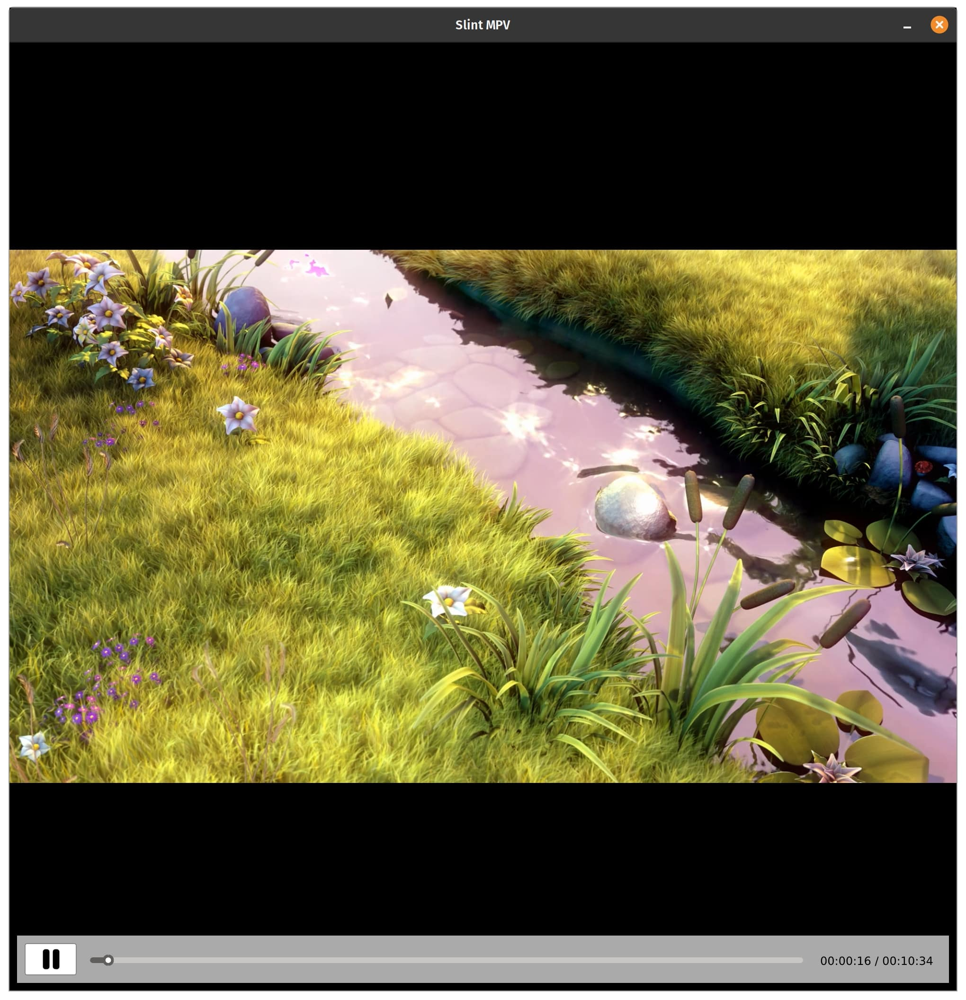

# Lumiere


Lumiere is a proof-of-concept/example video player built with the Slint UI framework and libmpv.
This was built quickly to try out Slint and it's new OpenGL underlay feature. As such, this player 
isn't really meant to be used (but it does work).

Instead of rendering on top of the UI window, lumiere gets MPV to draw into a framebuffer which is then bound to a texture and rendered underneath the UI, this way you can overlay UI elements and build a OSD for MPV with rust.

# Features
- [x] Play/Pause
- [x] Seekbar and seeking (kinda works)
- [ ] Everything else

# Installation
## Dependencies
* libmpv-dev
* rustc

## Running
```
cargo run -- path/to/file.mp4
```
